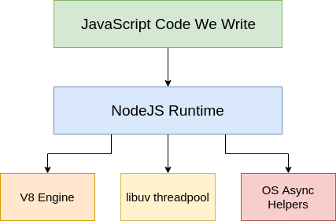

# NodeJS

> Node.js is a JavaScript runtime built on Chrome’s V8 JavaScript engine.

> NodeJS process is not “single-threaded”. “Event loop” is single-threaded.

- **Cross-platform JavaScript** runtime environment
- Runs the **V8 JavaScript engine**, the core of Google Chrome, outside of the browser
- A Node.js app is run in a **single process**, without creating a new thread for every reques
- Provides a set of **asynchronous I/O primitives** in its standard library that prevent JavaScript code from blocking and generally
- Libraries in Node.js are written using **non-blocking paradigms**, making blocking behavior the exception rather than the norm

## References

- https://nodejs.dev/learn
- https://www.tutorialsteacher.com/nodejs/nodejs-process-model
- https://www.javatpoint.com/nodejs-buffers

# A. Learn Enough

1. Setup
2. Editor, Debug
3. Modules
4. File I/O
5. Stream
6. Socket
7. Express
8. Data Access - MongoDB
9. Template Engine

> **Project 1**
> Build a personal music player list, the song can be :
>
> - MP4/MP3 (should be stream)
> - Youtube | Vimeo Link
>   Also, each song may have lyrics ( should be stream from server )
>   System should support fulltext search

1. Setup

```bash
# install node version manager
curl -o- https://raw.githubusercontent.com/nvm-sh/nvm/v0.35.2/install.sh | bash
# then run the following commands, and add them to your .bashrc

export NVM_DIR="$HOME/.nvm"

[ -s "$NVM_DIR/nvm.sh" ] && \. "$NVM_DIR/nvm.sh"  # This loads nvm

[ -s "$NVM_DIR/bash_completion" ] && \. "$NVM_DIR/bash_completion"

# verify version
nvm --version
nvm install node
nvm install 12.16.1
nvm ls-remote
nvm
nvm ls
nvm current
nvm ls
nvm alias default 12.16.1
nvm ls
```

2. Tools & Debug

- https://code.visualstudio.com/docs/nodejs/nodejs-debugging#_launch-configuration-attributes
- https://nodejs.org/en/docs/guides/debugging-getting-started/

> Some sample config

```json
{
  // Use IntelliSense to learn about possible attributes.
  // Hover to view descriptions of existing attributes.
  // For more information, visit: https://go.microsoft.com/fwlink/?linkid=830387
  "version": "0.2.0",
  "configurations": [
    {
      "name": "Launch Program",
      "program": "${workspaceFolder}/app.js",
      "request": "launch",
      "skipFiles": ["<node_internals>/**"],
      "type": "pwa-node",
      "args": ["--verbose"],
      "env": {
        "NODE_ENV": "local"
      }
    },

    {
      "type": "node",
      "request": "launch",
      "name": "Run Spec with Debugger",
      "skipFiles": ["<node_internals>/**"],
      "runtimeExecutable": "yarn",
      "runtimeArgs": ["debug"],
      "program": "${file}"
    },
    {
      "type": "node",
      "request": "launch",
      "name": "Debug Setup",
      "skipFiles": ["<node_internals>/**"],
      "runtimeExecutable": "yarn",
      "runtimeArgs": ["debug:script"],
      "program": "${fileBasenameNoExtension}"
    }
  ]
}
```

3. Modules

> 3.1.Built-in modules

- os, query, url, events, buffer, stream
- https://www.digitalocean.com/community/tutorials/using-buffers-in-node-js
- child_process
- timers: setInterval, setTimeout, setImmediate
- process.nextTick()

> 3.2.External Module

```bash
yarn add cowsay
ll node_modules/.bin/
total 8
drwxr-xr-x  2 sonnm sonnm 4096 Nov 27 13:48 ./
drwxr-xr-x 15 sonnm sonnm 4096 Nov 27 13:48 ../
lrwxrwxrwx  1 sonnm sonnm   16 Nov 27 13:48 cowsay -> ../cowsay/cli.js*
lrwxrwxrwx  1 sonnm sonnm   16 Nov 27 13:48 cowthink -> ../cowsay/cli.js*
sonnm@DESKTOP-78EN94K:~/src/github.com/misostack/nodejs$ node_modules/.bin/cowsay "tete"
```

```json
~0.13.0 : [0.13.0,0.13.x]
^0.13.0 : [0.13.0, ...)
0.13.0 : 0.13.0
```

```bash
yarn info lodash
yarn info lodash version
yarn info lodash versions
yarn add chalk
yarn remove chalk
```

- [YarnCheatsheet](https://devhints.io/yarn)
- [NPMCheatsheet](https://devhints.io/npm)

**The Semantic Versioning concept is simple: all versions have 3 digits: x.y.z.**

- the first digit is the major version
- the second digit is the minor version
- the third digit is the patch version

**npx**

> npx lets you run code built with Node.js and published through the npm registry.

```bash
yarn global add npx
```

> 3.3.Local Module

> 3.4.Public your module to npm

# C. Util & Topics

# C. MasterClass

0. Ref

- https://nodejs.org/en/docs/guides/event-loop-timers-and-nexttick/

> process.nextTick() fires immediately on the same phase
> setImmediate() fires on the following iteration or 'tick' of the event loop

> In essence, the names should be swapped. process.nextTick() fires more immediately than setImmediate(), but **this is an artifact of the past** which is unlikely to change. Making this switch would break a large percentage of the packages on npm. Every day more new modules are being added, which means every day we wait, more potential breakages occur. While they are confusing, the names themselves won't change.

> We recommend developers use **setImmediate()** in all cases because it's easier to reason about.

> **setTimeout** is especially useful to avoid blocking the CPU on intensive tasks and let other functions be executed while performing a heavy calculation, by queuing functions in the scheduler.

```javascript
setTimeout(() => {
  console.log("heavy process");
}, 0);

console.log(" before ");
```

> Write 1 billion lines on text file

```bash
sonnm@DESKTOP-78EN94K:~/src/github.com/misostack/nodejs$ ulimit -a
core file size          (blocks, -c) 0
data seg size           (kbytes, -d) unlimited
scheduling priority             (-e) 0
file size               (blocks, -f) unlimited
pending signals                 (-i) 50738
max locked memory       (kbytes, -l) 64
max memory size         (kbytes, -m) unlimited
open files                      (-n) 4096
pipe size            (512 bytes, -p) 8
POSIX message queues     (bytes, -q) 819200
real-time priority              (-r) 0
stack size              (kbytes, -s) 8192
cpu time               (seconds, -t) unlimited
max user processes              (-u) 50738
virtual memory          (kbytes, -v) unlimited
file locks                      (-x) unlimited
```

1. [ ] Headfirst

- Installation
- V8 vs libuv
- CLI & REPL
- Global Object, Process and Buffer
- [How require() actually works](https://www.freecodecamp.org/news/requiring-modules-in-node-js-everything-you-need-to-know-e7fbd119be8/)
- JSON and C++ Addons
- Wrapping and caching modules
- NPM vs Yarn

2. [ ] Concurrency Model and Event Loop

- I/O
- Event Loop
- Call Stack, call back
- Slow operations, setImmediate and process.nextTick

3. [ ] Event-Driven Architecture

- Callbacks, Promises and Async/Await
- Event Emitter
- Arguments, Errors, and Order of Listeners

4. [ ] Networking

- TCP Networking
- Multiple Sockets
- Chat Server
- DNS Module
- UDP Datagram Sockets

5. [ ] Web

- Streaming HTTP Server
- Requesting HTTP/HTTPS Data
- Routes, URLS, Query Strings

6. [ ] Common libs

- File
- OS
- Console

7. [ ] Debug

8. [ ] Streams

- Stream 101
- Readable and Writable stream
- Duplex Streams and Transform Streams

9. [ ] Clusters and Child Processes

- Scaling
- Fork vs cluster
- Load-balancing
- HA

10. [] Summary

> Build a personal music player list, the song can be :
>
> - MP4/MP3 (should be stream)
> - Youtube | Vimeo Link
>   Also, each song may have lyrics ( should be stream from server )
>   System should support fulltext search

- HOST: HEROKU
- DB: MongoDB

## 1. Headfirst

> 1.1. Instalation

> Use NVM to manage multiple node version

```bash
# install node version manager
curl -o- https://raw.githubusercontent.com/nvm-sh/nvm/v0.35.2/install.sh | bash
# then run the following commands, and add them to your .bashrc

export NVM_DIR="$HOME/.nvm"

[ -s "$NVM_DIR/nvm.sh" ] && \. "$NVM_DIR/nvm.sh"  # This loads nvm

[ -s "$NVM_DIR/bash_completion" ] && \. "$NVM_DIR/bash_completion"

# verify version
nvm --version
nvm install node
nvm install 12.16.1
nvm ls-remote
nvm
nvm ls
nvm current
nvm ls
nvm alias default 12.16.1
nvm ls
```

> 1.2. Debug

- https://code.visualstudio.com/docs/nodejs/nodejs-debugging#_launch-configuration-attributes
- https://nodejs.org/en/docs/guides/debugging-getting-started/

> 1.3. V8 vs libuv

**Ref:**

- https://chaudharypulkit93.medium.com/how-does-nodejs-work-beginner-to-advanced-event-loop-v8-engine-libuv-threadpool-bbe9b41b5bdd
- https://easyontheweb.com/nodejs-v8-and-libuv-under-the-hood-for-beginners/
- https://stackoverflow.com/questions/49811043/relationship-between-event-loop-libuv-and-v8-engine#:~:text=V8%20engine%20is%20used%20to,is%20responsible%20for%20multi%20threading.
- https://medium.com/@bharatrajmeriyala/node-js-event-loop-craziness-you-may-not-know-a7ef546d47be
- https://medium.com/javascript-in-plain-english/how-nodejs-works-event-loop-handling-async-operation-4bfc2781110f



**Summary**

- JavaScript is the language. NodeJS is the “runtime” responsible to execute JavaScript code.
- V8 is Google’s open source high-performance JavaScript and WebAssembly engine, written in C++.

When you start your node process by running node index.js, the following sequence of steps take place:

- V8 engine reads through and processes your index.js file. This includes requiring modules and executing any code in it.
- V8 engine then immediately starts up an “Event Loop”.

> V8:

- Compile and execute JavaScript code
- Provide memory heap to allocate and store your variables.
- Provide a call stack to run the functions in order.
- Garbage collector — to garbage collect the object and memory references not in use anymore.
- Provide data types, operators, object and functions to write the code in JavaScript language.
- Provide an event loop to run asynchronous code. (Side note: This is not always true. In some cases, like in the browser, browser’s APIs tend to provide the event loop too.)
- More : https://hackernoon.com/javascript-v8-engine-explained-3f940148d4ef

> Event loop:

- An “Event Loop” is some piece of code in a loop which picks up tasks from “Job/Task Queue” and sends them to V8 to be executed.

> The priority of the pick up from the “Job Queue” is as follows:

1. Pick up setTimeout and setInterval callbacks.
2. Pick up any pending OS operation callbacks. An example of an OS operation is a network call, like a REST API call to an API to get some data.
3. Pick up any pending I/O operations callbacks which have been executed by **libuv threadpool**. An example of an I/O operation is reading/writing a file using fs module.
4. Pause and wait for an event to happen. No, really. It just pauses the execution. “Event Loop” is a bit different from the for and while loops we are used to writing. The loops we write just keep executing as fast as possible. “Event Loop” literally pauses and waits for the stuff to happen. An example of the “stuff” is a new request on the NodeJS web server.
5. Pick up setImmediate callbacks.
6. Pick up any callbacks from close events.
7. Exit the loop if refs === 0

> “libuv”

- A library which provides a set of threads(threadpool) to NodeJS runtime to execute long-running tasks, like fs module-based tasks
- By default, it provides 4 threads to each node process but you can change the threadpool size by setting process.env.UV_THREADPOOL_SIZE to any value you want.
- In case you are running node in a cluster mode, each child gets 4 threads by default to play around with and changing process.env.UV_THREADPOOL_SIZE changes the number of threads for each child

> “OS Async Helpers”

- Are used when any low-level OS operations take place.
- Eg : a REST API call using http or https module or creation of a web server using http.createServer(). These operations never use the thread pool and are executed immediately as soon as a CPU core is available for operation.
