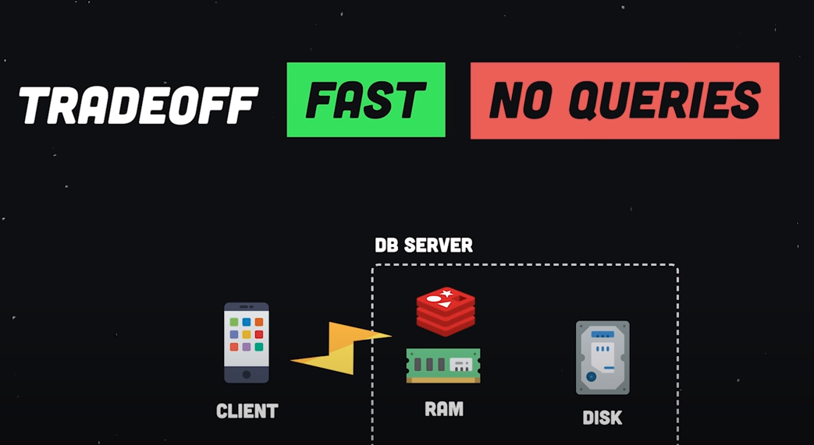
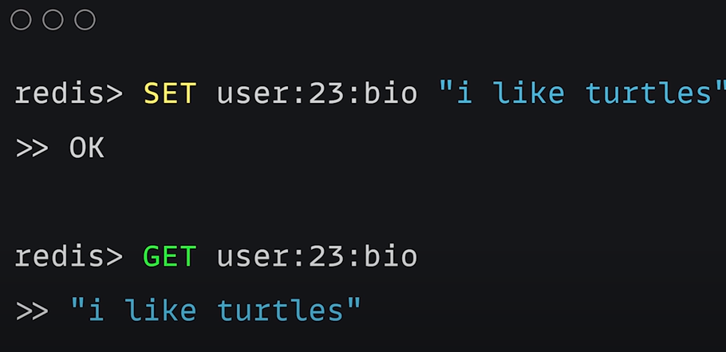
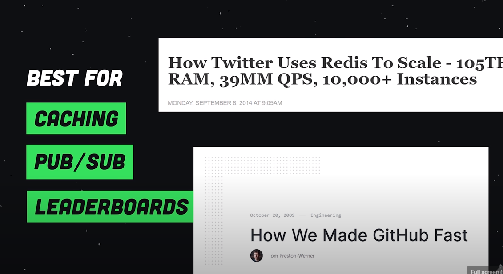
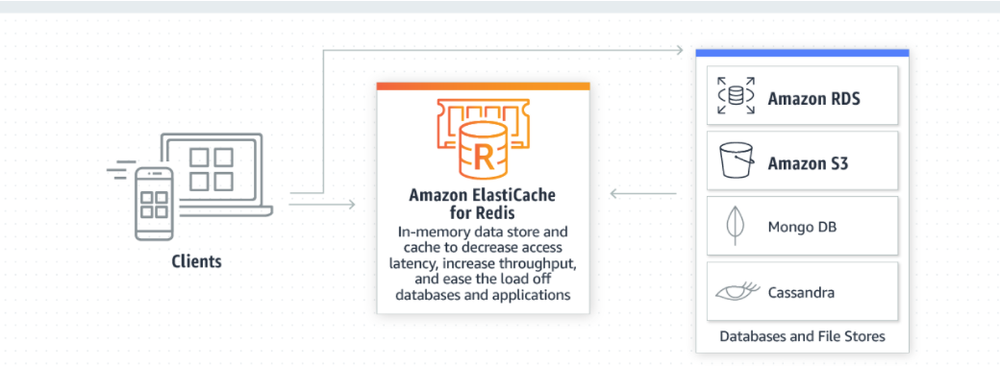

# Key Value

**Summary**

> The key-value database engines are best for

1. **CACHING**
2. **PUB/SUB** - **MessageQueue**
3. **LEADERBOARDS** - A board showing the ranking of leaders in a competition

> In the cases the key-value database is **Redis** or **Memcache**, all the data is hold in the machine memory

**TradeOFF**

- **FAST** vs **NO QUERIES**

**UseCases**

- [ ] Caching
- [ ] Session Store
- [ ] MessageQueue ( PUB/SUB )
- [ ] Realtime analytics

**Popular**

- [ ] Redis
- [ ] Memcache

**Overview**

**Usecases**

**AWS**

## Redis
