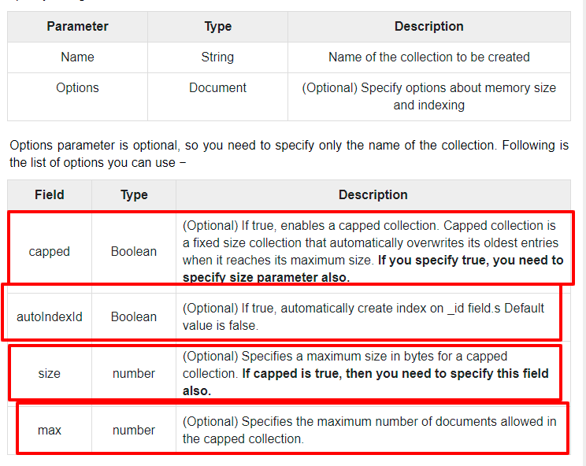

# MongoDB

> Search locations and sort by the best match

## Dataset

> User

```javascript
{
  id: '3a2dce36-ca1c-47ec-9ff7-0efa0060c7ec'
  firstName: 'Sơn',
  lastName: 'Nguyễn Minh',
  avatar: 'http://sa.sonnm.com/sonnm.png'
}
```

> Location

```javascript
{
  id: 'ChIJo0gAt5godTERWOupVcbFE3U',
  name: 'Cơm gà hà nội'
  address: '140/1, Lý Chính Thắng, Phường 7, Quận 3, Thành phố Hồ Chí Minh, Vietnam',
  latt: 106.712529,
  long: 10.803331,
  votes: [
    {
      like: true,//boolean
      createdAt: timestamp,
      updatedAt: timestamp,
      user: {
        id: '3a2dce36-ca1c-47ec-9ff7-0efa0060c7ec',
        displayName: 'Sơn Nguyễn Minh',
        avatar: 'http://sa.sonnm.com/sonnm.png',
      }
    }
  ]
}
```

## Topic

- [ ] Overview
- [ ] Advantages
- [ ] Installation
- [ ] CLI commands
- [ ] Tools
- [ ] Data Modeling & DataTypes
- [ ] Insert, Query, Update, Delete
- [ ] Projection, Limit,Sort
- [ ] Index
- [ ] Aggregation
- [ ] Map Reduce
- [ ] Text Search
- [ ] Regular Expression
- [ ] Common Atomic Operators

**Advanced**

- [ ] Relationship
- [ ] References
- [ ] Auto-Increment Sequence

**Production**

- [ ] Analyze: index, covered queries, objectid vs uuid
- [ ] Replication
- [ ] Sharding
- [ ] Backup
- [ ] Deployment

1. Overview

- Database
- Collection
- Document
- Field
- Embedded Documents
- Primary Key

2. Advantages

- Schema less
- Ease of scale-out
- No complex joins
- Capped Collection
- Auto-Increment sequence

**Why?**

- Document Oriented Storage - − Data is stored in the form of JSON style documents.
- Index on any attribute
- Replication and high availability
- Auto-Sharding
- Rich queries
- Fast in-place updates

**When?**

- Big Data
- Content Management and Delivery
- Mobile and Social Infrastructure
- User Data Management
- Data Hub

3. Installation

4. CLI commands

5. Tools

6. Data Modeling

7. Learn through the issue

> **Step1 : Modeling**

```javascript
const user = {
  id: '3a2dce36-ca1c-47ec-9ff7-0efa0060c7ec'
  firstName: 'Sơn',
  lastName: 'Nguyễn Minh',
  avatar: 'http://sa.sonnm.com/sonnm.png'
}

const location = {
  id: 'ChIJo0gAt5godTERWOupVcbFE3U',
  name: 'Cơm gà hà nội'
  address: '140/1, Lý Chính Thắng, Phường 7, Quận 3, Thành phố Hồ Chí Minh, Vietnam',
  latt: 106.712529,
  long: 10.803331,
  votes: [
    {
      like: true,//boolean
      createdAt: timestamp,
      updatedAt: timestamp,
      user: {
        id: '3a2dce36-ca1c-47ec-9ff7-0efa0060c7ec',
        displayName: 'Sơn Nguyễn Minh',
        avatar: 'http://sa.sonnm.com/sonnm.png',
      }
    }
  ]
}
```

> **Step2**: Creation

- Create **DB**

```bash
mongo
use semongodb; #create or switch db
show dbs; #check databases list
```

- Create **Collection**

> db.createCollection(name, options)



```json
db.createCollection('users');
```

Or

```json
db.users.insert({
  "_id": "3a2dce36-ca1c-47ec-9ff7-0efa0060c7ec",
  "firstName": "Sơn",
  "lastName": "Nguyễn Minh",
  "avatar": "http://sa.sonnm.com/sonnm.png"
});
db.users.insert({
  "_id": "3a2dce36-ca1c-47ec-9ff7-0efa0060c000",
  "firstName": "Sơn",
  "lastName": "Nguyễn",
  "avatar": "http://sa.sonnm.com/sonnm.png"
});
db.users.insert({
  "_id": "3a2dce36-ca1c-47ec-9ff7-0efa0060c001",
  "firstName": "Nguyễn",
  "lastName": "Sơn",
  "avatar": "http://sa.sonnm.com/sonnm.png"
});
db.users.insert({
  "_id": "3a2dce36-ca1c-47ec-9ff7-0efa0060c123",
  "firstName": "Son",
  "lastName": "Nguyen Minh",
  "avatar": "http://sa.sonnm.com/misostack.png"
});
show collections;
// drop collection
db.users.drop();
```

> Datatypes

- String
- Integer
- Boolean
- Double
- Min/ Max keys
- Arrays
- Timestamp
- Object
- Null
- Symbol
- Date
- Object ID
- Binary data
- Code: datatype is used to store Javascript code into the document
- Regular expression

> Query

```bash
db.users.find(); # find
db.users.find().pretty(); # find and pretty the output
db.users.findOne({firstName: "Sơn"}); # findOne
```

8. Fulltext search

> TextSearch Language : https://docs.mongodb.com/manual/reference/text-search-languages/

```bash
db.users.createIndex({"firstName":"text", "lastName": "text"});
# let's try
db.users.find({ $text: {$search: "Sơn"} });
db.users.find({ $text: {$search: "Sơn Nguyễn"} });
db.users.find({ $text: {$search: "sơn"} });
db.users.find(
  { $text: {$search: "sơn"} },
  { score: { $meta: "textScore" } }
);
db.users.find(
  { $text: {$search: "sơn"} },
  { score: { $meta: "textScore" } }
).sort( { score: { $meta: "textScore" } } );

db.users.find(
  { $text: {$search: "so nguyen"} },
  { score: { $meta: "textScore" } }
).sort( { score: { $meta: "textScore" } } );

db.users.find(
  { $text: {$search: "sơn nguyễn"} },
  { score: { $meta: "textScore" } }
).sort( { score: { $meta: "textScore" } } );

```
