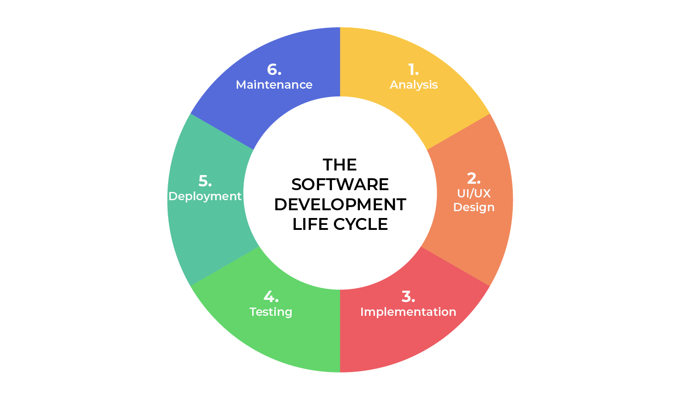
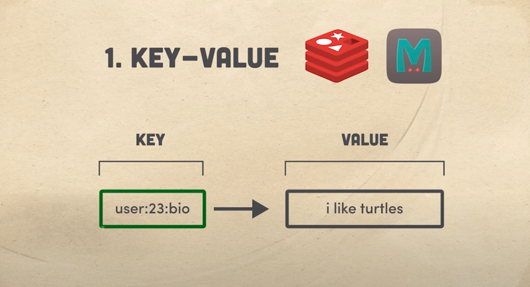

# SE Roadmap

> **Deconstruct the skill**

Look at the image about SDLC, Skills are breakdown into the following group

## 1. Analysis

### Technical Skills

- [ ] Technology
- [ ] Research
- [ ] Data Review/Statistical Analysis
- [ ] Financial Planning
- [ ] Documentation/Organization

### Personal Skills

- [ ] Problem Solving
- [ ] Decision Making
- [ ] Managerial Skills
- [ ] Communication
- [ ] Negotiation

### References

- Ebooks: A Guide to the Business Analysis Body of Knowledge(r) (Babok(r) Guide
- Skills: Office, Software Design Tools, Diagrams, SQL Queries, Business Process Models, ...
- https://www.zippia.com/research/business-analyst-skills/
- https://itviec.com/blog/business-analyst/
- https://itviec.com/blog/tai-lieu-business-analyst/

## 2. UI & UX

> UI là cái người dùng nhìn thấy. UX là cách người dùng sử dụng website/app đó. 1 website/app có thể có UI đẹp nhưng UX tệ

> Website có UX tốt sẽ chỉ đưa ra những thông tin mà người dùng quan tâm thôi.

### UI

- https://learnui.design/
- https://uxplanet.org/30-best-online-course-websites-to-learn-ui-ux-updated-6b104762731a

### UX

- Basic: https://www.uxapprentice.com/
- Advanced: https://uxmastery.com/

**Example**

> https://www.apple.com/iphone/

### References

- https://www.amazon.com/Dont-Make-Me-Think-Usability/dp/0321344758
- https://inspired-ui.com/
- https://inspirationmobile.tumblr.com/
- https://www.pttrns.com/
- https://www.pinterest.com/efreedman/ux-mobile-design-inspiration/
- https://hackernoon.com/what-is-ui-ux-design-1f01e9dbbf02

## 3. Implementation

### FE

- [ ] HTML
- [ ] CSS
- [ ] Javascript
- [ ] Web forms
- [ ] Accessibility — Make the web usable by everyone
- [ ] Client side frameworks

#### Client side frameworks

- [ ] **Ember** : older framework that has less users than more modern alternatives
- [ ] **Angular** : component-based framework which uses declarative HTML templates - typescript - **Angular** was officially released on the 14th of September 2016.
- [ ] Vue : Vue is the youngest of the big four, but has enjoyed a recent uptick in popularity. like AngularJS, extends HTML with some of its own code. - Evan You first released Vue in 2014, after working on and learning from the original AngularJS project
- [ ] **React** : **React** itself is not technically a framework; it's a library for rendering UI components. **React** is used in combination with other libraries to make applications — **React** and **React** Native enable developers to make mobile applications; **React** and **React**DOM enable them to make web applications - Facebook released **React** in 2013 - React extends JavaScript with HTML-like syntax, known as JSX

#### Alternatives to client-side frameworks

**Content management systems**

> Content-management systems (CMSes) are any tools that allow a user to create content for the web without directly writing code themselves. They're a good solution for large projects, especially projects that require input from content writers who have limited coding ability, or for programmers who want to save time

Popular examples include Wordpress, Joomla, and Drupal.

**Server-side rendering**

> Server-side rendering (SSR) is an application architecture in which it is the server's job to render a single-page application. This is the opposite of client-side rendering, which is the most common and most straightforward way to build a JavaScript application. Server-side rendering is easier on the client's device, because you're only sending a rendered HTML file to them, but it can be difficult to set up compared to a client-side-rendered application.

All of the frameworks covered in this module support server-side rendering as well as client-side rendering. Check out **Next.js** for React, **Nuxt.js** for Vue (yes it is confusing, and no, these projects are not related!), **FastBoot** for Ember, and **Angular Universal** for Angular.

**Static site generators**

> Static site generators are programs that dynamically generate all the webpages of a multi-page website

Static site generators have been around for quite a long time, but they have seen a bit of a revival in the recent history of the web. A handful of powerful options are now available, such as **Hugo**, **Jekyll**, **Eleventy**, and **Gatsby**.

#### Resources

- https://developer.mozilla.org/en-US/docs/Learn/Front-end_web_developer
- https://developer.mozilla.org/en-US/docs/Learn/Tools_and_testing/Client-side_JavaScript_frameworks/Introduction
- https://developer.mozilla.org/en-US/docs/Web/Tutorials
- https://developer.mozilla.org/en-US/docs/Games

### BE

#### Databases

> Use the right tool

1. [ ] Key-Value

- [ ] Redis
- [ ] Memcache

2. [ ] Wide Column

3. [ ] Document

4. [ ] Relational

5. [ ] Graph

6. [ ] Search Engine

7. [ ] Multi-model

#### Resources

- Database Paradigm :https://www.youtube.com/watch?v=W2Z7fbCLSTw
- Database Engines: https://db-engines.com/en/ranking

### Mobile

## 4. Testing

## 5. Deployment

## 6. Maintenance
